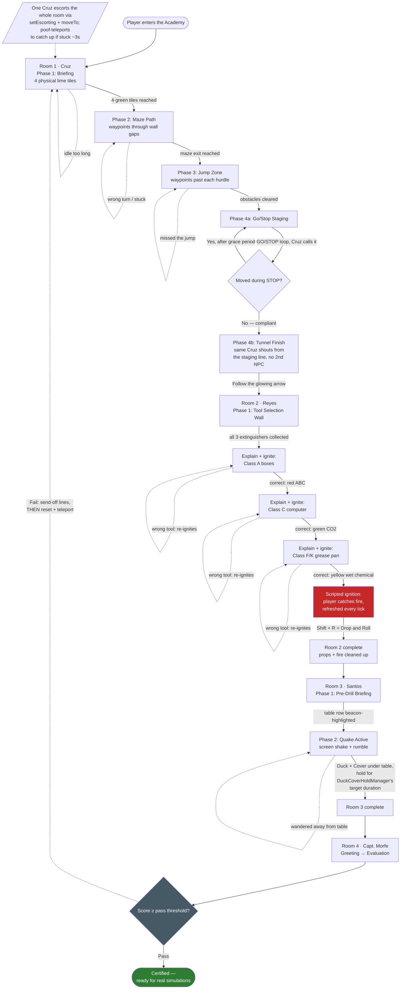

# New Tutorial Building — "The Academy" Script & Flow

This document is the full dialogue script, storyboard, and flow diagram for the new tutorial
building (`new_tut_building1.0.schem`, placed via `NewTutBuildingManager` at
`BlockPos(-177,-34,8)`). It is a **new, independent tutorial** ("the Academy") — it does not reuse
or replace the old tutorial (`tutorial/TutorialManager`, `tutorial/NpcDialogue`, the BFP Fire
Training Center lobby at `TutorialLobbyManager.TUTORIAL_LOBBY_POS`), which keeps functioning
exactly as it does today and remains the only thing currently gating the fire/quake simulation
buttons. See `CLAUDE.md`'s "New Tutorial Building (Academy)" section for the code-level
architecture.

**Voice rules (non-gamer friendly):** the exact key or button is named in §e in every instruction
("hold the §eW key§f", "press and hold §eShift§f", "left mouse button"), one clear action per line,
warm and reassuring — many students playing this have never touched Minecraft before. Real
BFP/PASS/Class A-C-K/Drop-Cover-Hold facts are still taught, just gently.

NPC name-tag colors below match `entity/NpcType.java`'s `displayName` exactly, since that's what
actually renders above each NPC's head in-game: Officer Cruz `§a`, Sgt. Reyes `§6`, Sgt. Santos
`§6`, Capt. Cesar Morfe Jr. `§c`.

All coordinates in this document are **schematic-verified** (the `.schem` was parsed directly;
NPC anchors, maze walls, jump hurdles, tunnel slabs, and the earthquake table row all match the
placed build).

---

## 1. Flow Diagram

---

## 2. Room 1 — Officer Cruz's Movement School

**NPC anchor:** `(-153.5,-33,32.5)` — a **single** Cruz escorts the player through every phase via
real pathfinding (`setEscorting` + periodic `moveTo`, FOLLOW_RANGE 48, STEP_HEIGHT 1.1 so she walks
the hurdles). If she can't path or falls behind for ~3 seconds she **poof-teleports** to the
player's side (POOF particles at both ends, reads as an intentional catch-up). She waits at the
Go/Stop staging line rather than entering the tunnel — her 1.8-block hitbox can't crouch under the
1.5-block slab headroom — and calls GO/STOP/finish from there. (The schematic's leftover second
Cruz at `(-123.5,-33,49.5)` is discarded on every placement by `NewTutBuildingManager`.)

### Phase 1 — Briefing Room (Mouse & WASD)
**Zone:** `(-154,-33,38)` to `(-137,-33,25)`. **Gate:** all 4 green tiles visited.
**The 4 marks are physical lime concrete floor tiles** placed by
`NewTutBuildingManager.placeGreenMarks` at `(-150,34)`, `(-146,30)`, `(-142,34)`, `(-139,30)`
(floor layer Y=-34; the schematic itself contains no green blocks). The **next** unhit tile also
gets the particle beacon (corner posts + pulsing ring + light beam), paired with the HUD compass
needle pointing at it.

> §a[Officer Cruz] §fHi there, trainee — welcome to the Academy! I'm Officer Cruz, and I'll walk
> with you every step of the way. First time playing? That's perfectly fine — we'll go slow and easy.
>
> §a[Officer Cruz] §fLet's start with your eyes. Move your §emouse§f gently to look around — left,
> right, up, down. Try it right now! Looking around calmly is the very first emergency skill.
>
> §a[Officer Cruz] §fNow your feet! Hold the §eW key§f to walk forward, the §eS key§f to back up,
> and §eA§f and §eD§f to step left and right. See the four §abright green tiles§f on the floor?
> Walk onto each one — I'll come with you!
>
> §a[Officer Cruz] §fTake all the time you need. Once you've stood on all four green tiles, we'll
> move on together. Off you go — I'm right behind you!

**Idle nudge:**
> §a[Officer Cruz] §7See the tall beam of green light? That's your next tile — hold the §eW key§7
> and walk to it!

**All four tiles reached:**
> §a[Officer Cruz] §fThat's all four — wonderful! Now for the maze: move your §emouse§f to look
> down the open path, then hold §eW§f to walk it. Follow the glowing arrow — I'm right beside you!

### Phase 2 — Maze Path (Steering Coordination)
**Zone:** `(-135,-33,38)` to `(-122,-33,25)`. **Gate:** reach the jump zone.
**Schematic-verified serpentine:** full-height walls at X=-131 (open only at Z=25), X=-127 (open
only at Z=38), X=-124 (open only at Z=25). The compass needle and Cruz's escort follow the waypoint
chain `(-131.5,25.5) → (-127.5,38.5) → (-124.5,25.5) → exit (-121.5,31.5)`, advancing when the
player comes within 2 blocks — neither ever points/paths straight into a wall.

**In-phase re-click line:**
> §a[Officer Cruz] §7Walls in the way? That's okay! Move your §emouse§7 to look down the open path
> first, THEN hold §eW§7 to walk. Look first, walk second.

**Off-track nudge:**
> §a[Officer Cruz] §7Hit a wall? No worries! Turn with your §emouse§7 first, spot the opening, then
> walk with §eW§7. The glowing arrow shows the way.

**Maze cleared:**
> §a[Officer Cruz] §fYou found the way through — great navigating! Now some low hurdles: keep
> holding §eW§f and tap the §eSpacebar§f just before each one to hop over. Ready? Jump!

### Phase 3 — Jump Zone (Spacebar Hurdles)
**Zone:** `(-122,-33,38)` to `(-106,-33,25)`. **Gate:** leave the zone (all hurdles cleared).
**Schematic-verified hurdles:** three 1-block-tall white-concrete rows at X=-117, X=-114, X=-111
(spanning Z 25-38). Waypoints just past each row: `(-116.5,31.5) → (-113.5,31.5) → (-110.5,31.5) →
exit (-105.5,31.5)`.

**In-phase re-click line:**
> §a[Officer Cruz] §7To hop a hurdle: keep holding §eW§7 and tap the §eSpacebar§7 just before you
> reach it. Missed one? No problem — back up and try again!

**Off-track nudge:**
> §a[Officer Cruz] §7Hold §eW§7 to keep walking and tap the §eSpacebar§7 just before each hurdle.
> Bumped one? Back up a step and try again!

**Hurdles cleared:**
> §a[Officer Cruz] §fAll hurdles cleared — you're a natural! Now come meet me at the tunnel
> entrance — just follow the glowing arrow — for our very last lesson.

### Phase 4 — "Go / Stop" Slab Tunnel (Shift Control)
**Staging line (reset point on a violation):** `(-103.5,-33,51)`. **Finish:** X ≤ -118.
**Schematic-verified tunnel:** top-slabs at Y=-32 in columns X=-115, -114, -110, -107, -106
(Z 40..62) — 1.5 blocks of headroom, so the player must crouch under them while traveling west.

> §a[Officer Cruz] §fLast lesson — my favorite: knowing when to §aGO§f and when to §cSTOP§f. See
> the low boards in the tunnel ahead? Press and hold §eShift§f to crouch, and you'll slip right
> under them while you walk.
>
> §a[Officer Cruz] §fHere's how it works: when I call §a§lGO!§r§f, hold §eW§f and keep walking.
> When I call §c§lSTOP!§r§f, let go of every key and stand perfectly still. In a real emergency,
> stopping at the right moment keeps you safe. Ready? Let's go!

**GO caption:**
> §a▶ GO! Hold the W key and keep walking!

**STOP caption:**
> §c■ STOP! Let go of every key and freeze!

**In-run re-click line:**
> §a[Officer Cruz] §7Listen for my call! §aGO§7 means walk (hold §eW§7). §cSTOP§7 means let go of
> all the keys and freeze.

**Violation** (moved more than `ACADEMY_GOSTOP_GRACE_TICKS` after a STOP call — warped back to the
staging line, counts a movement mistake):
> §c[Officer Cruz] §7Oops — you moved after STOP! That's okay, everyone does it once. Back to the
> start line: walk on §aGO§7, and when you hear §cSTOP§7, let go of all the keys right away.

**Finish line** (Cruz shouts from the staging line):
> §a[Officer Cruz] §fYou did it! You can look, walk, jump, crouch, and stop on command — that's
> everything you need. Now follow the glowing arrow to §6Sgt. Reyes§f for the Fire Safety Drill.
> She's friendly, I promise!

---

## 3. Room 2 — Sgt. Reyes's Fire Safety Drill

**Room volume:** `(-162,-33,23)` to `(-173,-33,10)`. **NPC anchor:** `(-172.5,-33,17.5)`.
**Gate to enter:** Room 1 complete.
> §6[Sgt. Reyes] §7Hi trainee! Finish Officer Cruz's movement lessons first — follow the glowing
> arrow back to her, then come see me!

### Phase 1 — Tool Selection Wall
Three extinguishers hang in glow item frames on the Z=10 wall: red ABC at `(-170,-32,10)`, green
CO2 at `(-168,-32,10)`, yellow wet-chemical at `(-166,-32,10)`.

> §6[Sgt. Reyes] §fHello, trainee — great to meet you! I'm Sergeant Reyes. Today you'll learn
> something that saves real lives: matching the right fire extinguisher to the right fire.
>
> §6[Sgt. Reyes] §fLook at the wall — three extinguishers. §cRED (ABC)§f is for ordinary things
> like paper and wood. §aGREEN (CO2)§f is for electrical fires — never water on those! §eYELLOW
> (wet chemical)§f is for kitchen oil and grease fires.
>
> §6[Sgt. Reyes] §fLet's get you equipped: walk up to each extinguisher and hit it with your
> §eleft mouse button§f — it pops off the wall, then walk over it to pick it up. Grab all three
> and we'll practice on some safe training fires!

**Idle nudge:**
> §6[Sgt. Reyes] §7Walk right up to each extinguisher and click it with your §eleft mouse button§7
> — it pops off the wall, then step onto it to pick it up. You need all three!

### Phase 2 — Live Fire Demo & Drop/Roll
Once all 3 extinguishers are in inventory, Sgt. Reyes teaches the three hazards **one at a time, in
a fixed order** (`ReyesRoomManager.HAZARDS`) — each hazard gets its own explanation, delivered
through the timed dialogue sequencer, *before* it's actually ignited. The props are code-spawned
(they are not part of the schematic) and are **cleaned up** (props AIR'd + leftover vanilla fire
swept from the room) on room finish, on a mid-demo logout/death, and on a Capt. Morfe fail-reset.

| Order | Hazard | Class | Correct extinguisher |
|---|---|---|---|
| 1 | `ArchiveBoxStackBlock` (paper/document boxes) | A — ordinary combustibles | Red ABC (`FireExtinguisherItem`) |
| 2 | `ComputerBlock` (`BURNING=true`) | C — electrical | Green CO2 (`CO2ExtinguisherItem`) |
| 3 | `UnattendedGreasePanBlock` | F/K — kitchen grease | Yellow wet chemical (`WetChemicalExtinguisherItem`) |

**In-phase re-click line:**
> §6[Sgt. Reyes] §7To use an extinguisher: press its §enumber key (1-9)§7 to hold it, aim at the
> §ebase§7 of the fire, and §ehold the right mouse button§7. Match the color to what's burning —
> you can do it!

**Per-hazard explanation** (`AcademyDialogue.REYES_HAZARD_LINES[idx]`, plays once per hazard;
`igniteHazard` — via the same `HazardManager.forceFailure` mechanism `HazardWandItem` uses — only
fires once the explanation finishes):

> §6[Sgt. Reyes] §fFirst practice fire — that stack of paper boxes! Paper and cardboard are
> "Class A": ordinary materials.
>
> §6[Sgt. Reyes] §fPress your §cRED ABC extinguisher§f's number key to hold it, walk close, aim at
> the §ebase§f of the fire, and §ehold the right mouse button§f. Sweep side to side!

> §6[Sgt. Reyes] §fNext — that computer is sparking! That's an electrical fire, "Class C".
>
> §6[Sgt. Reyes] §cNever use water or foam on electrical fires§f — electricity can travel back to
> you! Hold your §aGREEN CO2 extinguisher§f, get close, and §ehold the right mouse button§f to put
> it out.

> §6[Sgt. Reyes] §fLast one — that pan of cooking oil just caught fire! Grease fires are special:
> the wrong extinguisher can make them splash and spread.
>
> §6[Sgt. Reyes] §fHold your §eYELLOW wet chemical extinguisher§f, aim at the pan, and §ehold the
> right mouse button§f. It cools the oil and seals it safely. Nice and steady!

**Correct tool used:**
> §6[Sgt. Reyes] §aPerfect match! That's exactly the right extinguisher for that fire. Well done!

**Wrong extinguisher used** — the hazard **re-ignites immediately** instead of just warning; the
player must get it right before the sequence advances:
> §6[Sgt. Reyes] §cNot that one — the fire flared back up! §7No harm done. Look at what's burning,
> press the matching extinguisher's §enumber key§7, and §ehold the right mouse button§7 to try again.

**Scripted ignition** (once all 3 hazards are correctly handled — the player is set on fire and
*stays* on fire, refreshed every tick, until they actually drop and roll;
`ACADEMY_IGNITE_DEMO_TICKS` is only a 200-tick/10s safety-cap timeout):
> §6[Sgt. Reyes] §cOh! A spark caught your uniform — don't panic! §fPress and hold §eShift§f, then
> press §eR§f to Drop and Roll. Roll until the flames are out!

**Drop-and-roll compliance confirmed:**
> §6[Sgt. Reyes] §aFlames out — beautifully done! §fYou just learned how to keep yourself safe.
> Take a breath.
>
> §6[Sgt. Reyes] §fThree fires, three perfect matches — and you even put yourself out safely. I'm
> proud of you! Follow the glowing arrow to §6Sgt. Santos§f for the Earthquake Drill.

---

## 4. Room 3 — Sgt. Santos's Earthquake Drill

**Room volume:** `(-162,-33,25)` to `(-173,-33,38)`. **NPC anchor:** `(-170.5,-33,33.5)`.
**Gate to enter:** Room 2 complete. **Safe-zone table row (schematic-verified):** `TableBlock`
instances from `(-170,-33,29)` to `(-167,-33,29)` (a row of chairs at Z=28 faces it).

**Gate line:**
> §6[Sgt. Santos] §7Hello trainee! Finish the fire drill with Sgt. Reyes first — she's just next
> door. Come right back after!

### Phase 1 — Pre-Drill Briefing
> §6[Sgt. Santos] §fWell done getting this far! I'm Sergeant Santos. Earthquakes are different from
> fires — they give §cno warning at all§f. So we practice until the right move is automatic.
>
> §6[Sgt. Santos] §fSee that sturdy table glowing green? That's your safe spot. When the shaking
> starts, walk under it — hold the §eW key§f to move, then press and hold §eShift§f to crouch down
> low.
>
> §6[Sgt. Santos] §fRemember three words: §e§lDROP — COVER — HOLD ON!§r§f DROP down low (hold
> §eShift§f), take COVER under the table, and HOLD ON — stay there until the shaking completely
> stops.
>
> §6[Sgt. Santos] §fReady to try? The floor is about to shake — it's only practice, you're
> completely safe. Head for that glowing table the moment it starts!

**Pre-drill re-click line:**
> §6[Sgt. Santos] §7Any second now — keep your eyes on that glowing green table!

The table row is beacon-highlighted (corner posts + pulsing ring + light beam, refreshed every 5
ticks) for the whole duration of this room, via `AcademyVisuals.highlightBlocks`.

### Phase 2 — Quake Active
Screen shake + rumble start (own shake-intensity channel, same `CameraShake` mechanism the old
tutorial's quake stages already use):

> §c⚠ EARTHQUAKE! §fWalk to the glowing table (hold §eW§f), get under it, and press and hold
> §eShift§f — DROP, COVER, HOLD ON!

The player must crouch under/beside the highlighted table row (reusing `DuckCoverHoldManager`'s
existing crawl-under-table + cover-detection, unmodified) and hold for its existing target duration.

**Off-track nudge** (player wandered away from the table mid-quake):
> §6[Sgt. Santos] §7Get under the glowing table! Hold §eW§7 to walk there, then press and hold
> §eShift§7 to crouch — and stay put!

**Success** (target hold duration reached):
> §6[Sgt. Santos] §fAnd... the shaking has stopped. You dropped, covered, and held on like a pro!
> One last stop: follow the glowing arrow to §cCaptain Morfe§f for your results. Stand tall —
> you've earned it.

---

## 5. Room 4 — Capt. Cesar Morfe Jr.'s Evaluation

**Static command post:** `(-108.5,-33,77.5)` (eval desk with computer + bulletin boards at
`(-111..-113, 76-77)`). **Gate to enter:** Room 3 complete.
> §c[Capt. Morfe] §7Almost there, trainee! Complete Sgt. Santos's earthquake drill first — then
> come see me for your results.

Morfe now speaks through the same timed dialogue sequencer as the other instructors
(`AcademyDialogue.MORFE_LINES`/`MORFE_PASS_LINES`/`MORFE_FAIL_LINES`); only the score number and
weak-areas list are runtime-built by `AcademyScoring`.

### Greeting (plays first; the evaluation runs when it finishes)
> §c[Capt. Morfe] §fWelcome, trainee — I'm Captain Morfe, and it's an honor to meet you. You've
> walked with Cruz, fought fires with Reyes, and held steady through Santos's earthquake.
>
> §c[Capt. Morfe] §fEvery instructor sent me their notes, and I've put your full record together.
> Take a breath — let's see how you did.

Then the score printout: `§eYour Academy score: §fX / 100` (and, on a fail, `§eThings to practice:
§f...` with the specific weak areas).

### Pass (score ≥ threshold)
> §c[Capt. Morfe] §fSteady feet, the right extinguisher every time, and calm under a shaking roof.
> That's a passing record — §a§lyou are officially certified!§r
>
> §c[Capt. Morfe] §fBe proud of yourself — what you practiced today protects real people in real
> life. You're cleared for the full simulations. Congratulations, trainee!

### Already certified (re-click after passing)
> §c[Capt. Morfe] §fYou're already certified, trainee — no need to prove anything twice! Head out
> and enjoy the simulations. Stay sharp out there!

### Fail (score < threshold)
> §c[Capt. Morfe] §fYou're not quite there yet — and that is completely okay. Even our best
> firefighters ran these drills more than once.
>
> §c[Capt. Morfe] §fI'm sending you back to Officer Cruz for another practice run. Take it slow,
> listen to each instructor, and I'll be waiting right here to certify you. You can do this!

The reset (full progress wipe, Room 2 prop cleanup, teleport back to Room 1's briefing zone) fires
only **after** the fail lines finish playing, so the student reads them where they stand. On
arrival:
> §a[Officer Cruz] §fWelcome back for round two, trainee! Same as before — walk onto the four green
> tiles. You'll fly through it this time!

---

## 6. Guardrails (`academy/AcademyGuardrails.java`)

| Guardrail | Behavior |
|---|---|
| **Block protection** | Block break/place inside the building bounds (`AABB(-178,-40,7,-94,-20,86)`) is cancelled for non-admins (admins = OP 2+ or `/bfp bypass`), with a friendly throttled caption. Side effect by design: punching fire out by hand is also cancelled — extinguishers are the only defuse, which is what Room 2 teaches. Item-frame extinguisher pickup (an entity attack) is unaffected. |
| **Out-of-bounds rescue** | Every 20 ticks, any non-admin player mid-tutorial (started Room 1, not yet certified) outside the bounds or below Y=-36 is teleported to the anchor of the furthest room they've reached. |
| **Death/respawn recovery** | Dying mid-tutorial = same rollback as logging out (Santos's quake → NOT_STARTED, Reyes's ignite fire cleared, LIVE_FIRE_DEMO → TOOL_SELECTION with props cleaned) + teleport back to the current room instead of world spawn. |
| **Reyes prop cleanup** | The 3 code-spawned hazard props + any leftover vanilla fire in Room 2 are removed on room finish, mid-demo logout/death, and Morfe fail-reset. |
| **Cruz stuck-recovery** | 4 consecutive no-progress escort cycles (~3 s) → poof-teleport to the player's side. |

## 7. Shared Systems — Off-Track & "Seems Stuck" Nudges

Every room reuses the same periodic-recheck idiom already proven in `TutorialManager.tick`
(`gameTick % N == 0` re-prompt loop): if a player hasn't made progress toward their current phase's
gate for a while, the room manager re-sends that phase's own reminder caption (see each room's
"idle/off-track nudge" lines above) — always restating *what to do next* with the exact key named,
in-voice, not just "you're stuck." Nudges are suppressed while a timed dialogue sequence is
actively playing (`AcademyManager.isDialogueActive`), so they never stomp a caption mid-line.

## 8. Scoring Rubric (Capt. Morfe)

| Metric | Source room | Tracked as |
|---|---|---|
| Movement mistakes (Go/Stop violations) | Room 1 | `AcademyProgress.movementMistakes` |
| Correct vs. wrong extinguisher uses | Room 2 | `AcademyProgress.fireCorrectUses` / `fireWrongUses` |
| Drop-and-roll compliance during the scripted ignition | Room 2 | `AcademyProgress.dropAndRollPerformed` |
| Duck/Cover/Hold compliance | Room 3 | `AcademyProgress.quakeCompliant` |

`AcademyScoring.evaluate(...)` combines these into a 0-100 score via simple weighted thresholds
(pattern-cloned from `world/SimulationFeedback.java`'s rule-based scoring approach), compared
against `Config.ACADEMY_PASS_THRESHOLD` (default 70).

## 9. Resolved Items

Previously-open coordinate questions, now settled by parsing the schematic directly:

- Room 1's 4 green marks: **did not exist as blocks** — now physical lime concrete tiles placed at
  runtime (`NewTutBuildingManager.placeGreenMarks`) at the positions listed in §2 Phase 1.
- Maze wall layout: verified (walls at X=-131/-127/-124, gaps at Z=25/38/25) — drives the §2
  Phase 2 waypoint chain.
- Jump hurdles: verified (1-block rows at X=-117/-114/-111) — drives the §2 Phase 3 waypoints.
- Go/Stop tunnel: verified (top-slabs at Y=-32, columns X=-115/-114/-110/-107/-106, Z 40..62).
- Earthquake table row: verified at `(-170..-167,-33,29)` exactly as coded.
