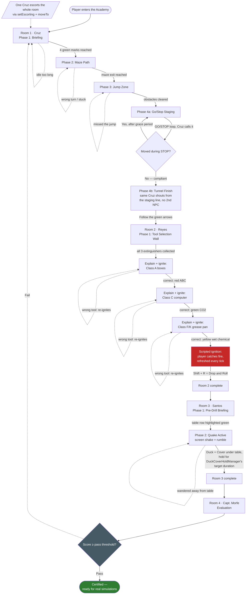

# New Tutorial Building — "The Academy" Script & Flow

This document is the full dialogue script, storyboard, and flow diagram for the new tutorial
building (`new_tut_building1.0.schem`, placed via `NewTutBuildingManager` at
`BlockPos(-177,-34,8)`). It is a **new, independent tutorial** ("the Academy") — it does not reuse
or replace the old tutorial (`tutorial/TutorialManager`, `tutorial/NpcDialogue`, the BFP Fire
Training Center lobby at `TutorialLobbyManager.TUTORIAL_LOBBY_POS`), which keeps functioning
exactly as it does today and remains the only thing currently gating the fire/quake simulation
buttons. See `CLAUDE.md`'s "New Tutorial Building (Academy)" section for the code-level
architecture, and `docs/f3_tuning_todo.md` for coordinates still needing in-game F3 verification.

Dialogue voice matches the old tutorial's tone (kid-friendly, explains *why* not just *what*, heavy
on exclamation points, teaches real BFP/PASS/Class A-B-C/Drop-Cover-Hold facts) — content is new,
not copied.

NPC name-tag colors below match `entity/NpcType.java`'s `displayName` exactly, since that's what
actually renders above each NPC's head in-game: Officer Cruz `§a`, Sgt. Reyes `§6`, Sgt. Santos
`§6`, Capt. Cesar Morfe Jr. `§c`.

---

## 1. Flow Diagram

---

## 2. Room 1 — Officer Cruz's Movement School

**Room volume:** `(-154,-33,38)` to `(-118,-33,40)` (approx; exact sub-zone boxes per phase below).
**NPC #1 (Phases 1-3 instructor):** `(-153.5,-33,32.5)`.
**NPC #2 (Phase 4 finish line):** `(-123.5,-33,49.5)`.

Both are separate `CustomNpcEntity` instances sharing `NpcType.OFFICER_CRUZ` — dispatch is by
nearest-anchor-to-the-clicked-entity, not a position threshold, so retuning either spot later can't
break which one responds.

### Phase 1 — Briefing Room (Mouse & WASD)
**Zone:** `(-154,-33,38)` to `(-137,-33,25)`. **Gate:** all 4 green floor marks visited (exact
per-mark coordinates: see `docs/f3_tuning_todo.md`, not yet F3-verified).

> §a[Officer Cruz] §fWelcome to the Academy, trainee! I'm Officer Cruz, and before we run, jump, or
> duck for anything — we start with the basics that keep you in control.
>
> §a[Officer Cruz] §fFirst, your eyes! Move your mouse to look around. Get comfortable turning your
> head left, right, up, and down — you'll need to spot hazards fast in a real emergency.
>
> §a[Officer Cruz] §fNow for your feet — §eW-A-S-D§f moves you: W forward, S back, A left, D right.
> See those four green marks on the floor? Walk to each one. Take your time, there's no rush yet!
>
> §a[Officer Cruz] §fOnce you've stepped on all four, come find me again and we'll move on to
> something trickier.

**Idle nudge** (fires periodically if the player hasn't reached a new mark in a while):
> §a[Officer Cruz] §7Still looking for the marks? They're glowing green on the floor — follow the
> arrows if you need a hand!

### Phase 2 — Maze Path (Steering Coordination)
**Zone:** `(-135,-33,38)` to `(-122,-33,25)`. **Gate:** reach the maze exit AABB.

> §a[Officer Cruz] §fNice work! Now let's put those turns to use. Follow the green arrows through
> this maze — it's simple, but you have to actually steer your camera, not just hold forward.
>
> §a[Officer Cruz] §fReal hallways during an emergency won't be straight lines either. Watch where
> you're walking and you won't bump into anything!

**Off-track nudge** (fires if the player lingers near a wall / hasn't progressed):
> §a[Officer Cruz] §7Bumping into walls slows you down in a real evacuation! Look at the green
> arrows and turn your camera before you turn your feet.

### Phase 3 — Jump Zone (Spacebar Hurdles)
**Zone:** `(-122,-33,38)` to `(-106,-33,25)`. **Gate:** clear the obstacle line (exact obstacle
X/Z positions: see `docs/f3_tuning_todo.md`).

> §a[Officer Cruz] §fObstacles ahead! Sometimes an emergency exit isn't perfectly clear — fallen
> chairs, debris, that sort of thing. Keep walking forward and hit §eSpacebar§f to hop right over
> them. Don't stop moving — momentum is your friend here!

**Off-track nudge** (fires if the player keeps colliding with an obstacle instead of jumping):
> §a[Officer Cruz] §7Keep your momentum! Walk straight at it and tap Spacebar right before you'd
> hit it.

### Phase 4 — "Go / Stop" Slab Tunnel (Shift Control)
**Start/briefing zone:** `(-97,-33,47)` to `(-107,-33,55)`.
**Staging line (reset point on a violation):** `(-103,-33,56)` to `(-103,-33,46)`.
**Active corridor / finish line:** `(-103,-33,62)` to `(-118,-33,40)`.

> §a[Officer Cruz] §fLast lesson, and it's the most important one — knowing when to §eGO§f and
> when to §cSTOP§f. Low slabs ahead mean you'll need to hold §eShift§f to crouch and slip under them.
>
> §a[Officer Cruz] §fHere's the drill: when I call §a§lGO!§r§f, keep moving forward. The instant I
> call §c§lSTOP!§r§f, freeze right where you are — real emergencies have moments where rushing
> forward is exactly the wrong move (a falling shelf, a blocked doorway, a signal from someone
> ahead of you). Ready? Here we go!

**GO caption** (sent when the phase flips to the GO window):
> §a▶ GO! Keep moving forward!

**STOP caption** (sent when the phase flips to the STOP window):
> §c■ STOP! Freeze right there!

**Violation** (player kept moving more than `ACADEMY_GOSTOP_GRACE_TICKS` after a STOP call — warped
back to the staging line):
> §c[Officer Cruz] §7Whoa — you moved after STOP! Back to the staging line. Watch for my call and
> freeze the instant you hear it.

**Finish line** (delivered by Cruz NPC #2, on reaching the corridor's end while compliant):
> §a[Officer Cruz] §fOutstanding! You've got sharp eyes, steady feet, and you know how to freeze on
> command. Follow the green floor arrows to Sgt. Reyes for your Fire Safety Drill!

---

## 3. Room 2 — Sgt. Reyes's Fire Safety Drill

**Room volume:** `(-162,-33,23)` to `(-173,-33,10)`. **NPC anchor:** `(-172.5,-33,17.5)`.
**Gate to enter:** Room 1 complete.

### Phase 1 — Tool Selection Wall
Three extinguishers hang in item frames on the wall at Z≈10: red ABC at `(-170,-32,10)`, green CO2
at `(-168,-32,10)`, yellow wet-chemical at `(-166,-32,10)`.

> §6[Sgt. Reyes] §fWelcome, trainee! I'm Sergeant Reyes, and fire doesn't care about your
> feelings — so we're going to learn exactly which tool beats which fire.
>
> §6[Sgt. Reyes] §fSee those three extinguishers on the wall? §cRed§f is your ABC extinguisher, for
> ordinary stuff like paper and wood. §aGreen§f is CO2, for electrical fires — never water, never
> foam, just CO2! §eYellow§f is wet chemical, for kitchen grease and cooking oil fires.
>
> §6[Sgt. Reyes] §fGrab all three off the wall. You'll need each one in a minute — I'm about to
> show you three real hazards, and only the right tool will put each one out!

**Idle nudge** (fires if the player hasn't picked up an extinguisher after a while):
> §6[Sgt. Reyes] §7Go ahead, take them off the wall! Walk up and click on each one.

### Phase 2 — Live Fire Demo & Drop/Roll
Once all 3 extinguishers are in inventory, Sgt. Reyes teaches the three hazards **one at a time, in
a fixed order** (`ReyesRoomManager.HAZARDS`) rather than igniting all three at once — each hazard
gets its own explanation of what's burning and why that specific tool, delivered through the timed
dialogue sequencer, *before* it's actually ignited:

| Order | Hazard | Class | Correct extinguisher |
|---|---|---|---|
| 1 | `ArchiveBoxStackBlock` (paper/document boxes) | A — ordinary combustibles | Red ABC (`FireExtinguisherItem`) |
| 2 | `ComputerBlock` (`BURNING=true`) | C — electrical | Green CO2 (`CO2ExtinguisherItem`) |
| 3 | `UnattendedGreasePanBlock` | F/K — kitchen grease | Yellow wet chemical (`WetChemicalExtinguisherItem`) |

**Per-hazard explanation** (`AcademyDialogue.REYES_HAZARD_LINES[idx]`, plays once per hazard;
`igniteHazard` — via the same `HazardManager.forceFailure` mechanism `HazardWandItem` uses — only
fires once the explanation finishes):

> §6[Sgt. Reyes] §fFirst up — that stack of document boxes! Paper and cardboard are Class A
> materials, ordinary combustibles.
>
> §6[Sgt. Reyes] §fGrab your §cred ABC extinguisher§f and put it out — aim at the base, sweep side
> to side!

> §6[Sgt. Reyes] §fNext — that computer's sparking! This is a Class C electrical fire.
>
> §6[Sgt. Reyes] §cNever use water or foam here.§f Grab the §aGreen CO2 extinguisher§f — it won't
> conduct electricity back into you!

> §6[Sgt. Reyes] §fLast one — that pan of oil is a Class F/K kitchen fire! Regular extinguishers can
> make grease fires explode.
>
> §6[Sgt. Reyes] §fGrab the §eyellow wet chemical extinguisher§f — it cools and seals the oil
> safely!

**Correct tool used** — the sequence advances to the next hazard's explanation (or, after the
third, into the scripted ignition below).

**Wrong extinguisher used** — the hazard **re-ignites immediately** (`checkAndHandleDefuse` calls
`igniteHazard` again on the same prop) instead of just warning; the player must get it right before
moving on:
> §6[Sgt. Reyes] §c...the fire flares right back up! That's not the right tool for this one — think
> about what's burning before you spray.

**Scripted ignition** (once all 3 hazards are correctly handled, Reyes "demonstrates" what happens
if you're not careful — the player is set on fire and *stays* on fire, `tickIgniteDemo` refreshing
their remaining fire ticks every tick, until they actually drop and roll):
> §6[Sgt. Reyes] §c...caught a spark! Hit §eShift§f, then press §eR§f to Drop and Roll it out — just
> like we practice!

**Drop-and-roll compliance confirmed** (`DropAndRollManager.isDropped` observed true — this is what
clears the fire, not a timer; `ACADEMY_IGNITE_DEMO_TICKS` is only a 200-tick/10s safety-cap timeout
for a player who never rolls):
> §6[Sgt. Reyes] §a...smothered! You just put yourself out safely. Great reflexes!
>
> §6[Sgt. Reyes] §fYou've mastered all three fire classes and how to handle catching fire yourself.
> Head over to Sgt. Santos for the earthquake drill — you're doing amazing!

---

## 4. Room 3 — Sgt. Santos's Earthquake Drill

**Room volume:** `(-162,-33,25)` to `(-173,-33,38)`. **NPC anchor:** `(-170.5,-33,33.5)`.
**Gate to enter:** Room 2 complete. **Safe-zone table row:** `TableBlock` instances from
`(-170,-33,29)` to `(-167,-33,29)`.

### Phase 1 — Pre-Drill Briefing
> §6[Sgt. Santos] §fGreat work in there! I'm Sergeant Santos, and earthquakes strike without any
> warning at all — no countdown, no siren first. That's exactly why we drill for it.
>
> §6[Sgt. Santos] §fSee that reinforced table glowing green? That's your designated safe zone.
> When the ground starts shaking, that's exactly where you're headed.
>
> §6[Sgt. Santos] §fRemember the three words: §e§lDROP — COVER — HOLD ON!§r§f Drop low so you don't
> fall. Get cover under something solid. Hold on and stay there until the shaking stops completely.
>
> §6[Sgt. Santos] §fReady? I'm starting the drill now — brace yourself!

The table row glows continuously (green particle outline, refreshed every 5 ticks) for the whole
duration of this room, via `AcademyVisuals.highlightBlocks`.

### Phase 2 — Quake Active
Screen shake + rumble start (own shake-intensity channel, same `CameraShake` mechanism the old
tutorial's quake stages already use):

> §c⚠ EARTHQUAKE! Drop, Cover, and Hold On — get under the table and brace yourself!

The player must crouch under/beside the highlighted table row (reusing
`DuckCoverHoldManager`'s existing crawl-under-table + cover-detection, unmodified — this room only
watches its `isCompliant`/`ticksHeld` state) and hold for its existing target duration.

**Off-track nudge** (player wandered away from the table mid-quake):
> §6[Sgt. Santos] §7Get back under the table! The ground is still moving!

**Success** (target hold duration reached):
> §6[Sgt. Santos] §fThe shaking has stopped. Good composure out there — that's exactly how it's
> done. Proceed to Captain Morfe for your final debrief.

---

## 5. Room 4 — Capt. Cesar Morfe Jr.'s Evaluation

**Room volume:** `(-112,-33,70)` to `(-105,-33,77)`. **Static command post:** `(-108.5,-33,77.5)`.
**Gate to enter:** Room 3 complete.

Capt. Morfe stands at attention and, on interact, runs `AcademyScoring.evaluate(progress)` — a
rule-based rubric over the tracked metrics from all three rooms (see §7 below) — and delivers a
branching verdict.

> §c[Capt. Morfe] §fAt ease, trainee. I've reviewed the full record of your run through the
> Academy — movement discipline with Officer Cruz, fire response with Sergeant Reyes, and your
> composure with Sergeant Santos. Let's see how you did.

### Pass (score ≥ threshold)
> §c[Capt. Morfe] §fYour movement control was sharp, your fire suppression was accurate, and you
> held your position through the earthquake drill without breaking. Congratulations, trainee — you
> are certified.
>
> §c[Capt. Morfe] §eScore: §fX / 100
>
> §c[Capt. Morfe] §fYou're cleared for the real simulations. Stay just as sharp out there.

### Fail (score < threshold)
> §c[Capt. Morfe] §cYour record shows some critical gaps under pressure — [specific called-out
> weak area(s), e.g. "you froze past the STOP window more than once" / "you reached for the wrong
> extinguisher too many times" / "you broke cover before the shaking stopped"].
>
> §c[Capt. Morfe] §eScore: §fX / 100
>
> §c[Capt. Morfe] §fThat's not a passing mark yet. Return to Room 1 and run the drills again —
> everyone needs more than one pass sometimes. Dismissed.

On fail, the player's phase progress **and** scoring counters reset to a clean slate, and they're
teleported back to Room 1's briefing zone.

---

## 6. Shared Systems — Off-Track & "Seems Stuck" Nudges

Every room reuses the same periodic-recheck idiom already proven in `TutorialManager.tick`
(`gameTick % N == 0` re-prompt loop) via a new generic `OffTrackTracker`: if a player hasn't made
progress toward their current phase's gate for longer than a room-appropriate idle window, the
room manager re-sends that phase's own reminder caption (see each room's "idle/off-track nudge"
lines above) rather than a generic one-size-fits-all message — the goal is always to restate
*what to do next*, in-voice, not just "you're stuck."

## 7. Scoring Rubric (Capt. Morfe)

| Metric | Source room | Tracked as |
|---|---|---|
| Movement mistakes (Go/Stop violations, off-track count) | Room 1 | `AcademyProgress.movementMistakes` |
| Correct vs. wrong extinguisher uses | Room 2 | `AcademyProgress.fireCorrectUses` / `fireWrongUses` |
| Drop-and-roll compliance during the scripted ignition | Room 2 | `AcademyProgress.dropAndRollPerformed` |
| Duck/Cover/Hold compliance | Room 3 | `AcademyProgress.quakeCompliant` |

`AcademyScoring.evaluate(...)` combines these into a 0-100 score via simple weighted thresholds
(pattern-cloned from `world/SimulationFeedback.java`'s rule-based, event-driven scoring approach —
no external calls, purely server-side arithmetic), compared against a pass threshold (new `Config`
knob, mirroring `Config.PASS_THRESHOLD_FIRE`'s existing convention).

## 8. Open Items

The room *boundaries* and all 4 NPC anchors above are confirmed against the placed schematic's
actual entity data. The following finer coordinates were given descriptively but not as exact F3
readings, and need an in-game pass before the corresponding phase-gating code can be finalized —
tracked in `docs/f3_tuning_todo.md`:

- Room 1 Phase 1's 4 green floor marks (exact `BlockPos` each).
- Room 1 Phase 2's maze wall layout (for off-track "bumped a wall" detection).
- Room 1 Phase 3's obstacle line (exact X/Z of each white-concrete hurdle).
